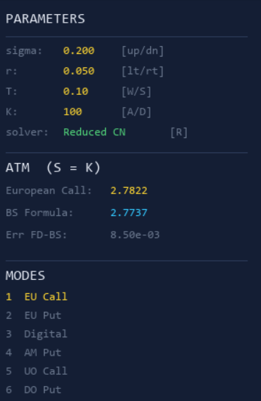
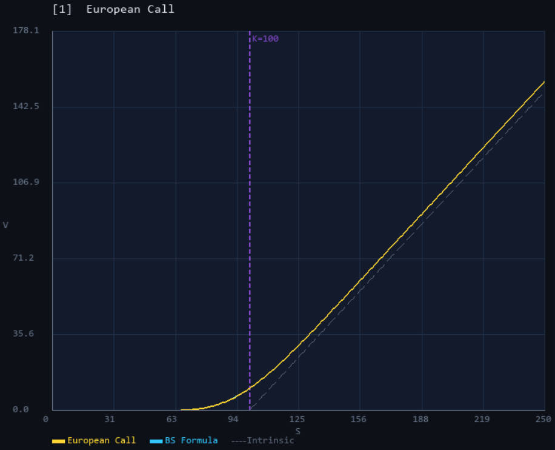
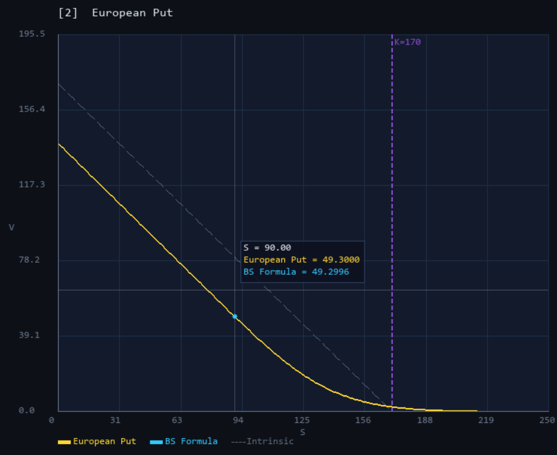
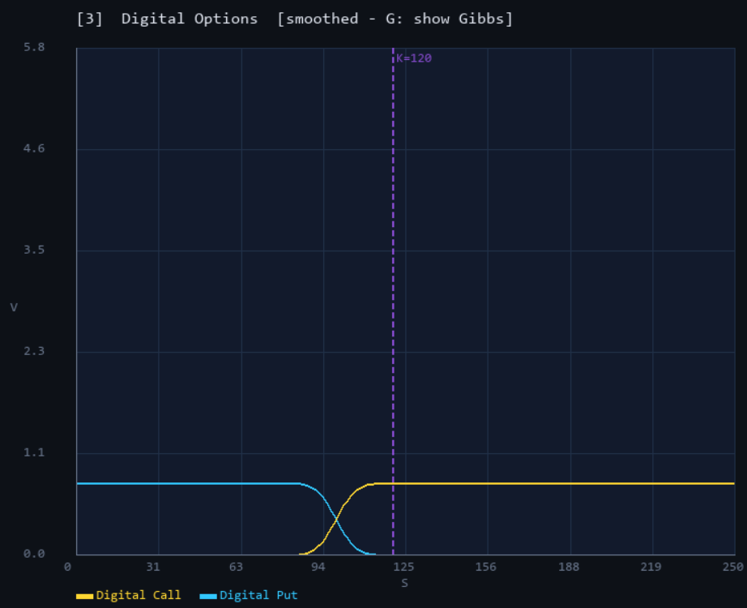
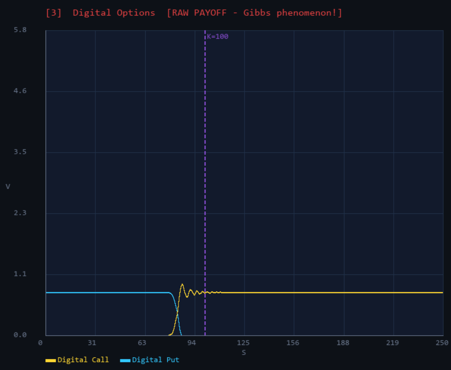
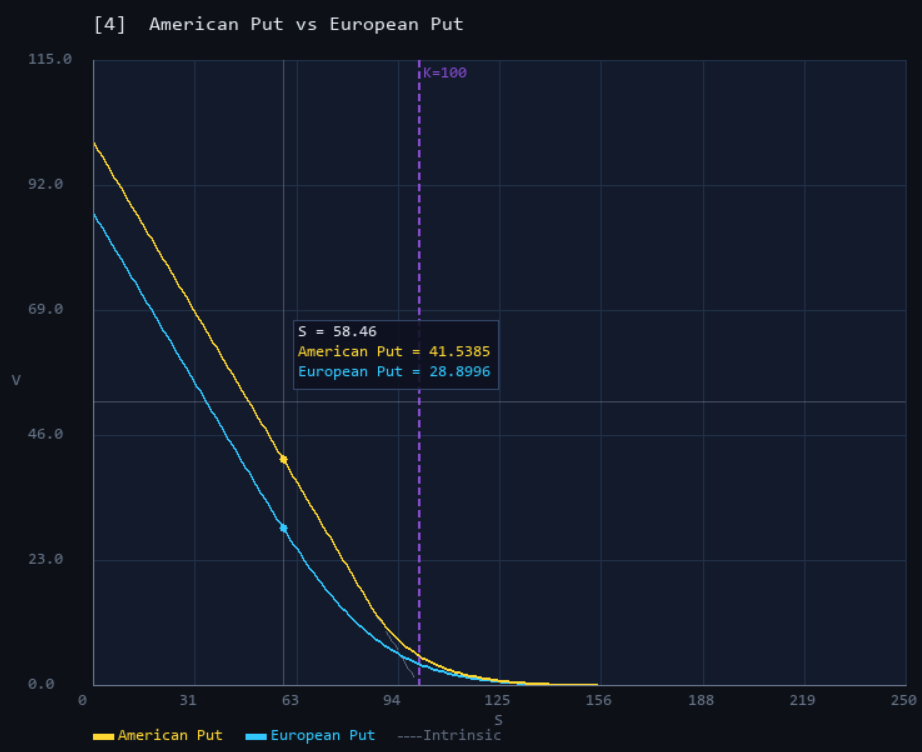
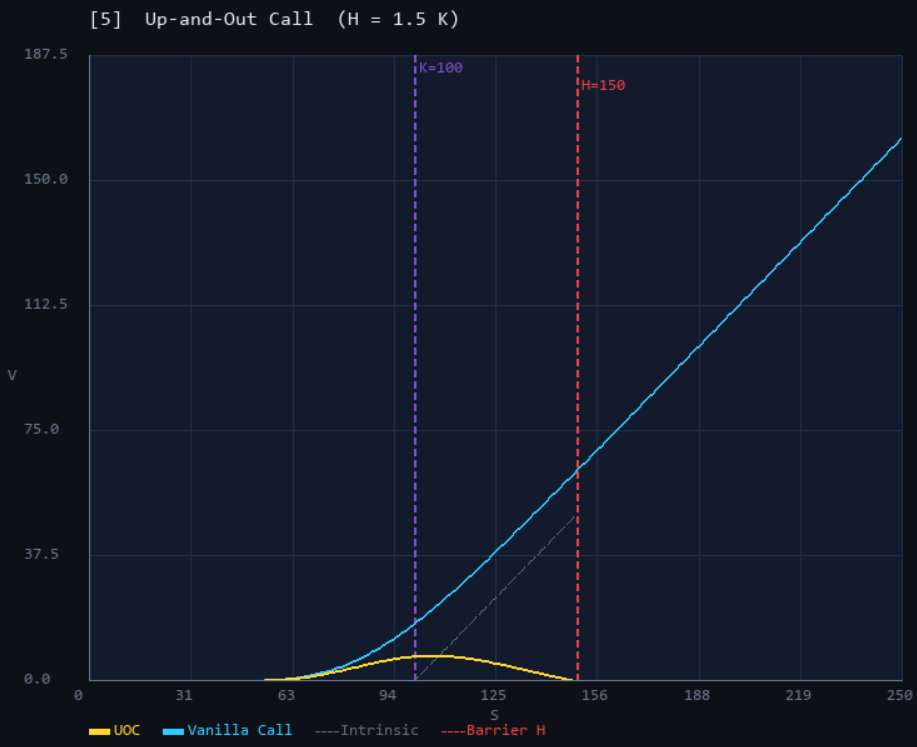
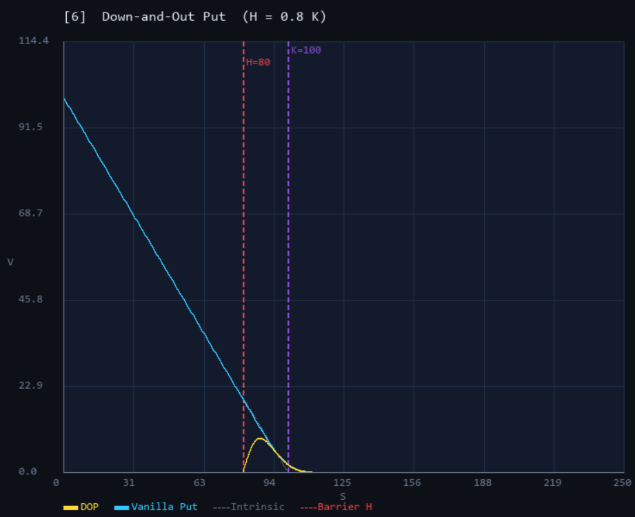

# Black-Scholes PDE Pricer — C++


A C++ implementation of European and exotic option pricing by solving the Black-Scholes PDE numerically,
with two independent finite-difference schemes, full Greeks computation, analytical validation,
and a **real-time interactive SDL2 visualizer**.

First commit built at **ENSIIE** (2024–2025), in collaboration with [Vithuson Vaithilingam](https://github.com/VithuVa).
Other commits done on my own.

---

## The problem

The Black-Scholes PDE governs the fair value $V(t, S)$ of an option:

$$\frac{\partial V}{\partial t} + \frac{1}{2}\sigma^2 S^2 \frac{\partial^2 V}{\partial S^2} + rS\frac{\partial V}{\partial S} - rV = 0$$

with terminal condition $V(T, S) = \text{Payoff}(S)$ and boundary conditions depending on the option type.
The PDE is solved **backwards in time** on a discrete $(S, t)$ grid, from maturity $t = T$ down to today $t = 0$.

---

## Numerical methods

### Crank-Nicolson on a uniform S-grid

Standard centred finite differences on $S_i = i \cdot \Delta S$ yield a spatial operator:

$$\mathcal{L}[V]_i = a_i V_{i-1} + b_i V_i + c_i V_{i+1}$$

where $a_i, b_i, c_i$ depend on $S_i$ (variable coefficients). The Crank-Nicolson scheme
averages the implicit and explicit levels:

$$\frac{V_i^{n-1} - V_i^n}{\Delta t} = \frac{1}{2}\left(\mathcal{L}[V^{n-1}]_i + \mathcal{L}[V^n]_i\right)$$

This produces a **tridiagonal linear system** per time step, solved in $O(N)$ via the Thomas algorithm.
Properties: second-order in both time $O(\Delta t^2)$ and space $O(\Delta S^2)$, unconditionally stable.

### ReducedCN — Crank-Nicolson in log-price space

The substitution $x = \ln S$ transforms the BS PDE into a **constant-coefficient** PDE:

$$\frac{\partial V}{\partial t} + \frac{1}{2}\sigma^2 \frac{\partial^2 V}{\partial x^2} + \kappa \frac{\partial V}{\partial x} - rV = 0, \qquad \kappa = r - \tfrac{1}{2}\sigma^2$$

Key advantages over the S-space scheme:
- Coefficients $a, b, c$ are **constant** across all nodes — no growth for large $S$
- The log-uniform grid $\Delta x = \text{const}$ gives finer relative resolution near the strike
- $x = \ln S$ is the natural variable of the GBM dynamics (Itô's lemma)

After solving, $V(x_i)$ is interpolated back onto the uniform $S$-grid for output and display.

---

## Greeks

| Greek | Method | Cost |
|-------|--------|------|
| $\Delta = \partial V / \partial S$ | Central FD on solved grid | Free |
| $\Gamma = \partial^2 V / \partial S^2$ | Central FD on solved grid | Free |
| $\Theta = \partial V / \partial t$ | PDE identity: $\Theta = -\mathcal{L}[V]$ | Free |
| $\nu = \partial V / \partial \sigma$ | Bump-and-reprice $\sigma \pm \varepsilon$ | 2 solver calls |
| $\rho = \partial V / \partial r$ | Bump-and-reprice $r \pm \varepsilon$ | 2 solver calls |

Theta is recovered for free from the PDE itself — since $\partial V / \partial t = -\mathcal{L}[V]$,
Theta is just the spatial operator evaluated at the solution. No time differencing needed.

All Greeks are validated against closed-form Black-Scholes formulas (`BSFormula.hpp`).

---

## Key results

| Metric | Value |
|--------|-------|
| European Call ATM (K=100, T=1, σ=20%, r=5%) | FD = 10.387, BS = 10.451 |
| FD–BS error ($N = M = 1000$) | $\sim 10^{-2}$ |
| Early-exercise premium at S=58, T=1 | American Put − European Put ≈ +12.6 |
| UOC vs Vanilla Call at S=110, T=1 | Knock-out discount ≈ −55% |
| Digital put-call parity error | < $10^{-4}$ (smoothed payoff) |

---

## Features

**Pricing**
- Black-Scholes call and put pricing (FD + analytical)
- Full Greeks: delta, gamma, theta, vega, rho
- Put-call parity and analytical validation

**Exotic options**
- Digital Call / Put — cash-or-nothing payoffs
- Up-and-Out Barrier Call — Dirichlet knock-out boundary at $H = 1.5K$
- Down-and-Out Barrier Put — lower-barrier knock-out at $H = 0.8K$
- American Put — early-exercise projection at each time step

**Numerical**
- Two independent FD schemes: Crank-Nicolson and Reduced CN (log-space)
- $O(N)$ Thomas algorithm for tridiagonal systems
- Payoff smoothing (sigmoid) to suppress Gibbs oscillations at discontinuities

**Interactive visualizer (SDL2)**
- Real-time price curve with live parameter controls
- 6 display modes, switchable with keys `1`–`6`
- Mouse hover crosshair with exact $(S, V)$ read-off
- Solver toggle (CN ↔ Reduced CN), curve visibility, Gibbs demo

---

## Project structure

```
BS-Pricer/
├── main.cpp                # Console driver: Europeans + all exotic types
│
├── main_viz.cpp            # Entry point for the SDL2 interactive visualizer
├── Visualizer.hpp/.cpp     # Full SDL2 visualizer — 6 modes, live controls, hover tooltip
│
├── Option.hpp              # Abstract Option interface + 6 concrete payoff classes:
│                           #   EuropeanCall, EuropeanPut, DigitalCall, DigitalPut,
│                           #   BarrierKnockOutCall, AmericanPut
│
├── Grid.hpp / Grid.cpp     # Uniform (S, t) grid — storage, initialisation, BCs
│
├── Solver.hpp              # Abstract Solver interface + BSParams struct
│
├── CrankNicolson.hpp/.cpp  # CN scheme on uniform S-grid (variable coefficients)
├── ReducedCN.hpp/.cpp      # CN scheme on log-uniform x-grid (constant coefficients)
│
├── Greeks.hpp / Greeks.cpp # Delta, Gamma, Theta (FD) + Vega, Rho (bump-and-reprice)
├── BSFormula.hpp/.cpp      # Closed-form BS pricing and Greeks (analytical reference)
│
├── Thomas.hpp / Thomas.cpp # O(N) tridiagonal solver (Thomas algorithm)
│
├── Graphiques/             # Screenshots for the visualizer modes
└── Makefile
```

---

## Build

### Console pricer

Requires **GCC** with C++17:

```bash
make
./pricer
```

### SDL2 interactive visualizer

Requires **SDL2** and **SDL2_ttf**. On MSYS2/MinGW-w64:

```bash
pacman -S mingw-w64-x86_64-SDL2 mingw-w64-x86_64-SDL2_ttf
```

Then:

```bash
make viz
./pricer_viz
```

---

## Interactive visualizer

The visualizer runs the finite-difference solver live and redraws the price curve whenever a parameter changes.
Mouse hover shows a crosshair and the exact $(S, V)$ values for every visible curve.

### Side panel



The side panel shows live model parameters, ATM values for the active mode, and the full mode list.
The solver name (Crank-Nicolson or Reduced CN) is shown in green and toggled with `R`.

### Keyboard controls

| Key | Action | Range |
|-----|--------|-------|
| `1`–`6` | Switch display mode | |
| `↑` / `↓` | Volatility $\sigma$ ± 0.01 | 0.01 – 0.80 |
| `←` / `→` | Risk-free rate $r$ ± 0.005 | 0.001 – 0.20 |
| `W` / `S` | Time to maturity $T$ ± 0.1 yr | 0.1 – 5.0 |
| `A` / `D` | Strike $K$ ± 5 | 5 – 240 |
| `R` | Toggle solver: Crank-Nicolson ↔ Reduced CN | |
| `M` | Toggle main curve visibility | |
| `O` | Toggle overlay curve visibility | |
| `G` | Toggle payoff smoothing — shows/hides Gibbs oscillations (Digital mode) | |
| `ESC` / `Q` | Quit | |

---

## Display modes

### Mode 1 — European Call

FD price curve (gold) overlaid with the Black-Scholes analytical formula (cyan).
The intrinsic value $\max(S - K, 0)$ is shown as a dashed reference.
Both curves are nearly indistinguishable, confirming the FD accuracy.



---

### Mode 2 — European Put

FD price curve (gold) vs analytical BS formula (cyan). The hover tooltip reads off both values simultaneously —
here at $S = 90$: FD gives 49.3000, BS gives 49.2996, an error of 0.0004.



---

### Mode 3 — Digital Options (smoothed)

Digital Call (gold) and Digital Put (cyan) plotted together. The two curves sum to the discount factor
$e^{-rT}$ at all spot prices, verifying **put-call parity** for digital options.
Payoff smoothing (sigmoid of width $\Delta S$) eliminates Gibbs oscillations at the strike.



---

### Mode 3 — Digital Options (Gibbs phenomenon)

Pressing `G` switches to the raw step-function payoff. The **Gibbs phenomenon** becomes visible:
the Crank-Nicolson scheme produces ringing oscillations near the discontinuity at the strike.
This is a well-known artefact of applying a smooth numerical scheme to a discontinuous boundary condition.



---

### Mode 4 — American Put vs European Put

The American Put (gold) strictly dominates the European Put (cyan) for $S < K$, since early exercise
may be optimal when the option is deep in-the-money. The gap is the **early-exercise premium** —
here ~12.6 at $S = 58$. Both curves converge to the intrinsic payoff $\max(K - S, 0)$ for $S \to 0$.



---

### Mode 5 — Up-and-Out Call

The UOC (gold) is worth significantly less than the Vanilla Call (cyan): the holder loses everything
if the spot ever crosses the barrier $H = 1.5K$ (red dashed line). The UOC price peaks between
strike and barrier then collapses to zero — the classic **barrier smile** shape.



---

### Mode 6 — Down-and-Out Put

The DOP (gold) is knocked out if the spot falls below $H = 0.8K$ (red dashed line).
This eliminates most of the put's deep ITM value: the DOP price is a narrow hump concentrated
in the corridor $[H, K]$, far below the Vanilla Put (cyan).



---

## Sample console output

```
== European Call  (K=100, T=1, sigma=0.2, r=0.05) ==

  [Crank-Nicolson]

  S = 70.00000  [OTM]
    Price  FD =   0.43398   BS =   0.44145   err =   0.00747
    Delta  FD =   0.07487   BS =   0.07588
    Gamma  FD =   0.01011   BS =   0.01020
    Theta  FD =  -0.00336   BS =  -0.00341  (daily)
    Vega   FD =   9.87998   BS =   9.99690
    Rho    FD =   4.79958   BS =   4.86983

  S = 100.00000  [ATM]
    Price  FD =  10.38696   BS =  10.45058   err =   0.06362
    ...
```

Errors are of order $10^{-2}$ for $N = M = 1000$, consistent with the $O(\Delta S^2, \Delta t^2)$
convergence of the Crank-Nicolson scheme.

---

## Key concepts

**Thomas algorithm** — solves a tridiagonal system $Ax = d$ in $O(N)$ by forward elimination
and back substitution, replacing the $O(N^3)$ cost of general Gaussian elimination.

**Crank-Nicolson** — implicit-explicit averaging achieving $O(\Delta t^2, \Delta S^2)$ accuracy
while remaining unconditionally stable, unlike the explicit scheme which requires $\Delta t = O(\Delta S^2)$.

**Log-price change of variable** — $x = \ln S$ maps variable-coefficient BS into a constant-coefficient
PDE, eliminating the $S^2$ growth of the diffusion term and producing a geometrically-spaced grid
with better resolution near the strike.

**PDE identity for Theta** — rather than finite-differencing in time, Theta is read directly
from the spatial operator $\mathcal{L}[V]$ via the BS PDE itself, which is both cheaper
(no extra time slice) and more accurate.

**Gibbs phenomenon** — digital payoffs have a discontinuity at the strike. Applying a smooth
numerical scheme to a step-function boundary condition produces ringing oscillations near the strike.
Payoff smoothing (sigmoid of width $\Delta S$) suppresses these while preserving the correct
limiting values.

**Early-exercise projection** — at each backward time step for the American put, the solution is
projected: $V_i \leftarrow \max(V_i,\, K - S_i)$. This enforces the constraint that early exercise
is always available, and the resulting gap above the European put is the early-exercise premium.

**Dirty-flag architecture** — the visualizer separates the expensive PDE solve (`build_scene`, ~50 ms)
from the cheap redraw (`render`, <1 ms). The solver only reruns when a parameter changes; hover
and cursor updates run at 60 fps without triggering a re-solve.

**Polymorphic design** — `Option`, `Solver`, and `GreeksCalculator` are decoupled via abstract interfaces.
Swapping `CrankNicolson` for `ReducedCN` (or any future scheme) requires no changes to the Greeks
or visualizer code.

---

## Parameters

| Parameter | Default | Description |
|-----------|---------|-------------|
| `SMAX` | 250 | Upper boundary of the spatial grid |
| `NV` | 300 | Number of spatial nodes (visualizer) |
| `MV` | 300 | Number of time steps (visualizer) |
| `K` | 100 | Strike price (adjustable in visualizer: `A`/`D`) |
| `sigma` | 0.20 | Volatility (adjustable: `↑`/`↓`) |
| `r` | 0.05 | Risk-free rate (adjustable: `←`/`→`) |
| `T` | 1.00 | Time to maturity in years (adjustable: `W`/`S`) |

---

## Roadmap

**Phase 0 ✓** — European options, two FD schemes, full Greeks, analytical validation.

**Phase 1 ✓** — Exotic options:
- Digital Call / Put with Gibbs smoothing
- Up-and-Out Barrier Call and Down-and-Out Barrier Put
- American Put with early-exercise projection

**Phase 2 ✓** — SDL2 interactive visualizer:
- Six display modes with real-time solver re-run on parameter change
- Mouse hover crosshair with exact $(S, V)$ read-off on all curves
- Solver toggle (CN ↔ Reduced CN), curve visibility toggles, Gibbs demo

**Phase 3 — in progress (on hold pending market data fetcher):**

The next step is to validate the model against **real market data**: extract live option prices and implied volatilities, calibrate $\sigma$ to the market smile, and compare the FD pricer output to observed quotes.
This phase is blocked on a separate market-data fetcher project (under development) that will supply the option chains and historical price series.

Planned features once the fetcher is ready:
- **Implied volatility extraction** — invert the BS formula to recover $\sigma_\text{impl}(K, T)$ from market option prices
- **Volatility smile / surface** — visualize the smile and term structure of implied vol
- **Model validation** — compare FD prices to market quotes across strikes and maturities
- **Dupire local-volatility** — calibrate $\sigma(S,t)$ from the surface and solve the resulting non-constant-coefficient PDE
